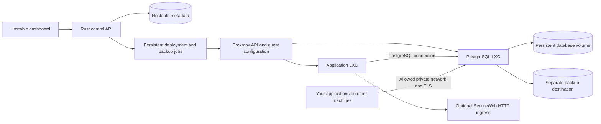

# Hostable Build Status and Completion Plan

Assessed on 3 October 2026 against the current working tree on `main`, based on commit `6d05955` plus existing local changes.

Hostable's local container and database platform core is implemented. It is now in the integration and acceptance phase: installation, live deployments, database connectivity, persistence, recovery and upgrades still need to be proved on Proxmox.

The product direction confirmed for this plan is **a Proxmox container platform that can also host databases which your own applications connect to directly**. PostgreSQL is the proposed first supported database. The older `hostable.yml` schema and generated CRUD API proposal is superseded by this direction.

## Implementation update

The user authorized local implementation first; Proxmox access will follow later. The follow-up implementation covers recommendations 2-6 and extends the existing OCI converter with managed image and guest update workflows.

| Area | Implemented locally | Remaining acceptance or scope |
| --- | --- | --- |
| Baseline and packaging | Toolchain pins, passing frontend checks, root Docker build, embedded playbooks, CI and checksum releases | Fresh dependency install, Linux build and release installation |
| Deployment and jobs | Shared executor, separate storage, reserved VMID allocation, ownership/node/type checks, task exit checks, boot/IP/HTTP/TCP readiness, authenticated replay | Live image boot, mounts, console, storage capability checks |
| Operation recovery | Persistent rollout stages and pending tasks, conflict guards, safe cancellation checkpoints, partial deployment recovery, interrupted volume handoff rollback, stale-plan rejection | Kill/restart tests at every live task stage; concurrent Proxmox operator changes |
| OCI and recipes | Existing conversion/extraction retained, immutable selected manifest digest, bounded integrity checks, private registry CA trust, BusyBox/native init selection, atomic archives and cache cleanup, immutable JSON recipe versions, explicit health/update policy | Supported image/runtime/signal/network matrix; Linux merged-/usr test and catalog publication after smoke tests |
| Image replacement | Stopped replacement LXC and new root, pre-update backup, same-node persistent volume transfer, net0 preservation, health/ingress checks, retained roots and rollback | Actual storage move support, unprivileged UID ownership, downtime, failed gateway recovery and host restart |
| Guest maintenance | APT/APK or application script through verified node SSH and pct exec, snapshot-before-update, restart policy, bounded timeout, health checks, automatic rollback, opt-in scheduling | Real node SSH, guest package/app update managers, storage snapshot support and failed-command recovery |
| Observability | Minute health reports, application HTTP/TCP checks, resource/filesystem alerts, guest application logs and known-secret redaction, SQL readiness/connections/sizes, backup and certificate warnings | Real saturation/full-disk/unreachable cases, log rotation in supported recipes and monitoring usability |
| PostgreSQL hosting | Dedicated Debian recipe, persistent data mount, TLS/SCRAM/CIDRs, per-app roles, credentials, access, attachment and data-preserving retirement | Real guest bootstrap, external clients, isolation, persistence and capacity tests |
| Backup and recovery | Scheduled logical dumps, snapshot row counts and SHA-256, optional GPG ciphertext on separate destination, verified new-target restores, scheduled separate-instance drills, retained failed targets, manager backup scripts | Actual cross-instance TLS PostgreSQL and fresh-manager disaster recovery; WAL/PITR is future scope |
| Certificates and credentials | Stable managed CA, automated/manual leaf renewal and SQL verification, rotation attachment alerts, same-image credential delivery by replacement | Live reload and client continuity; legacy self-signed CA migration is explicit operator work |
| Database major migration | New supported instance, logical backup/restore and application replacement with a new database attachment | Live version compatibility and application checks; in-place major upgrade is not implemented |
| Gateway and release | Optional gateway with durable route state/errors, retained installer binary and rollback, preserved credentials; validated main pushes publish checksummed releases; portal update checks and opt-in unattended service updates with offline metadata backup and rollback | First GitHub pipeline and published artifact; real systemd/OpenRC upgrade/recovery; DNS/HTTPS/traffic reconciliation and installation/reboot acceptance |
| Dashboard and CLI | Applications/updates, health/recovery, versioned catalog, operation inspection/cancellation/recovery, database renewal, real API-backed deployment/update CLI | Browser interactions, accessibility/usability and live infrastructure acceptance |

The implementation is in integration and acceptance. No production-ready or live Proxmox acceptance claim is made. Retained roots/snapshots and backups are deliberate recovery points; cleanup is operator-controlled. PITR, in-place PostgreSQL major upgrades, high availability, arbitrary image compatibility and destructive data deletion remain separate scope.

### Validation record

Local checks on 3–4 October 2026:

- Backend: the locked offline unit run passed **41 tests**, with **3 explicitly ignored infrastructure tests**. The locked offline backend build passed. New checks cover init selection, absolute image link targets, failed compression preserving an existing archive and removing its partial output. The Linux-only merged-/usr metadata test is added but awaits CI.
- Explicit cryptographic checks: the **GPG encryption/decryption/integrity test passed** with a disposable keyring. The **managed CA renewal test passed**, verifying repeated leaf signing retains CA trust and rejects requested CA privileges. Temporary keys and fixtures were removed. These two checks are not included in the 41 standard passes.
- API: **38 tests passed** against disposable SQLite metadata, a Proxmox HTTP fixture, a guest-command transport and a local HTTPS OCI registry. The registry exercises real layer conversion and multipart archive upload, image deployment, replacement fixed to the reviewed digest despite a moving tag, persistent-volume handoff and retained-root rollback. It also checks private CA trust, corrupt-layer rejection, failed-pull cache cleanup and complete repeated pulls. Other coverage includes failed-start rollback, safe cancellation, manager-restart recovery, configuration/policy drift, recipe immutability, in-guest updates and CLI/API parity. Registry images are protocol fixtures, never booted. No real SSH or Proxmox connection was made.
- Frontend: Svelte checks passed with **zero errors and zero warnings**, TypeScript passed and the Vite production build passed. The local npm launcher is broken after file cleanup, so installed tools ran through Node directly. A fresh npm dependency installation was not tested.
- Source checks: Rust formatting, Git whitespace checks, Bash syntax for installers/recovery scripts, and YAML parsing for playbooks/tasks/workflows passed. Ansible execution remains a Linux/infrastructure acceptance step.
- Docker is unavailable locally. The real PostgreSQL role/rotation/backup/restore/cross-instance verification test remains unrun here. CI is configured for separate TLS PostgreSQL 16 and 17 fixtures, encryption, CA signing and Linux checks, but has not run during this session.
- Browser automation could not initialize because its kernel assets were missing. No interactive browser acceptance is claimed.
- Portal update tests cover stable release selection and asset origins, authenticated persistent policies, refusal to update source installs, job draining, checksum/version rejection, retained backups, failed readiness rollback and interrupted-worker recovery. Service transitions and file locking are simulated in the Windows worker fixtures; actual Linux service replacement remains an acceptance gate.
- No live Proxmox installation, image boot/replacement, package/script update, database provisioning, certificate reload, gateway traffic or disaster-recovery drill was run.

### Next infrastructure acceptance sequence

1. Run CI from a clean checkout and prove the Linux binary/runtime, playbook syntax and disposable PostgreSQL tests.
2. On disposable Proxmox, deploy the Nginx candidate and a stateful sample application. Verify environment, init/signals, network, ownership and persistent mounts across restart.
3. Replace an image with persistent data, verify the same address and data, and roll back. Inject backup, volume move, start, health and gateway failures. Restart the manager during a cutover and recover through the recorded operation.
4. Run supported APT/APK/application-script maintenance with verified node keys; check service restart, timeout/cancellation and snapshot rollback. Validate scheduled updates only after manual acceptance.
5. Provision PostgreSQL, connect allowed external clients, deny forbidden networks, check role isolation, rotate credentials and deliver them to an attached application. Renew a leaf and confirm existing CA trust still works.
6. Encrypt and restore a backup into a separate instance, check application data and run the automated drill. Simulate manager loss and recover metadata/secrets plus dumps onto a fresh manager. Exercise the new-instance major migration procedure.
7. Install and upgrade a published checksum release, test binary rollback and host reboot, verify optional HTTPS ingress, then record the supported version/image/storage matrix and release evidence.

The phase descriptions below retain the original assessment and acceptance design as historical context. The current source status is the table above; uncompleted infrastructure gates are still required.

## Baseline at assessment (before implementation)

These statuses describe source implementation and local checks. They do not establish that the feature works on a live Proxmox installation.

| Area | Current state | Remaining work |
| --- | --- | --- |
| Rust backend and embedded Svelte dashboard | Implemented | Build checks, consistent API contracts, installation verification |
| OCI image conversion | Substantial implementation: image resolution, layers, whiteouts, filesystem metadata, init injection, compression, caching | Validate supported images on Linux and Proxmox, runtime compatibility, integrity checks, interruption and resource limits |
| Container provisioning | Ansible orchestration and native Proxmox fallback exist | Storage separation, correct failure handling, durable jobs, parity between execution paths |
| Container management | Listing, power operations, snapshots, telemetry, and terminal transport exist | Correct node and workload targeting, route alignment, actual console and log verification |
| Authentication | Hashed admin tokens, authenticated routes, origin configuration, input validation exist | Token lifecycle, secret handling, consistent TLS behavior, actionable readiness reporting |
| Catalog | UI and stack deployment code exist | Repair volume contracts and replace unvalidated combined root filesystems with tested deployment recipes |
| Hostable metadata database | SQLite and PostgreSQL backends exist | Apply versioned migrations and persist platform resources and operations |
| Application database hosting | Partial older API hook only | Provision a real database service, persistent storage, per-application credentials, networking, connection details, backups and restore |
| SecureWeb integration | Client and dashboard exist | Confirm the external gateway contract, propagate errors, persist/reconcile routes, verify health and HTTPS |
| Packaging and installers | Docker build, release workflow, host and in-container installers exist | Reproducible builds, asset packaging, reachable Proxmox configuration, TLS/runtime dependencies, upgrade verification |
| Automated acceptance coverage | Local Python suite exists | Track it in Git, align it with the product, run actual deployment and database scenarios |

### Evidence from this assessment

- `npm run build` passed. It reported two accessibility warnings and a JavaScript bundle size warning.
- `npm run check` failed with three TypeScript errors: callers pass `warn` to a toast type that accepts only `success`, `error`, and `info`. The errors are in `Converter.svelte` and `SecureWebGateway.svelte`.
- `cargo fmt --manifest-path backend/Cargo.toml --check` failed with formatting differences in the existing backend changes.
- The first `cargo test --offline --locked --manifest-path backend/Cargo.toml` attempt stopped while compiling dependencies because the drive ran out of space. This is an environment failure, not a test result.
- After disk cleanup, `cargo check --offline --locked --jobs 2 --manifest-path backend/Cargo.toml` passed with development debug symbols and incremental compilation disabled. This confirms the current backend compiles on the available Windows toolchain; it does not verify unit tests or Linux/Proxmox behavior.
- `python -m pytest tests_e2e/ --collect-only -q` collected 91 tests. Collection is not a passing test run. Seventy-four collected cases belong to the superseded BaaS tiers and are marked to skip by `conftest.py`; the other 17 are live API surface tests.
- `tests_e2e/`, the old project scope files, and test readiness documents are ignored by Git. They will not be available to CI or a fresh clone until the relevant files are tracked.
- There are existing changes in 12 tracked files, covering backend hardening, configuration, documentation, and installers. They require review and validation before being accepted as a baseline.
- No live Proxmox deployment, gateway operation, or application database connection was exercised during this assessment.

## Concrete issues to address first

| Priority | Finding | Evidence | Required outcome |
| --- | --- | --- | --- |
| P0 | Frontend type checks fail | `frontend/src/lib/toast.ts`; `Converter.svelte:111,177`; `SecureWebGateway.svelte:60` | All checks pass with one supported toast contract |
| P0 | Deploy task stream lacks authentication | `Converter.svelte:156` opens `/api/ws/tasks/{id}` without a token; `ansible.rs:810` requires authentication | Authenticated progress, event replay and terminal failure/success states work |
| P0 | Template and root disk storage are conflated | Wizard filters root disk pools; `ansible.rs:208` uses `storage_pool` for template upload too | Separate validated template and root disk storage selections |
| P0 | Deployment can report success after failure | `ansible.rs:528,543` discards task/start errors; legacy deploy paths sleep and discard start errors | Success requires successful Proxmox tasks, confirmed running state and applicable service readiness |
| P0 | Host installer configures a loopback Proxmox address inside a different container | `install.sh:64` sets `PVE_HOST=127.0.0.1` and writes it to the manager LXC | Manager uses a reachable host address and an explicit working TLS trust configuration |
| P0 | Catalog volume payloads do not match the backend contract | `Catalog.svelte:143` transforms `storage:8G:/path` into a three-part string; backend accepts a four-part managed storage spec or validated bind mount | Use structured volume objects shared by catalog, wizard, backend and executor |
| P0 | Current database hook does not provide database hosting | `converter.rs:150` uses the metadata DB, assumes a server at the manager IP, and injects shared defaults; `db.rs:215` ignores PostgreSQL creation failures and does nothing for SQLite | Database hosting is a separate managed service with verified connectivity and dedicated credentials |
| P1 | Some management UI routes are inconsistent | `LxcManager.svelte` calls singular `/lxc/{id}/restart` and `/api/ws/{id}`; backend exposes plural restart and `/api/ws/logs/{id}` | One documented route contract tested from the browser |
| P1 | Resource operations target the default node | LXC handlers use `state.default_node`; listing includes both LXC and QEMU resources | Resolve the real node and type before each operation; expose supported controls only |
| P1 | Ansible is not packaged with the application | `ansible.rs:346` uses a relative playbook path; installers deploy the binary and packages | Ship versioned playbooks/roles at a deterministic path or explicitly use the native executor |
| P1 | TLS behavior differs between execution paths | Rust client has a setting; Ansible roles hardcode `validate_certs: false` | Share the configured trust policy and support a CA certificate |
| P1 | Gateway registration can appear successful when it failed | `secureweb.rs:84,120` changes memory state and ignores upstream results; default gateway URL points to Hostable itself | Show real connection status and persist desired and confirmed route state |
| P1 | Local build and container defaults differ from dashboard startup | `build.bat:7` supplies the wrong build context; Docker runtime defaults to `manage` | One root-context build command and an explicit supported `start` service entrypoint |

`DatabaseManager.svelte` and `ProxyRouter.svelte` are currently unused screens that call endpoints absent from the router. The database screen should be redesigned around hosted database instances and connection details. Reusing the existing SQL editor without implementing its contract would not complete database hosting.

## Proposed architecture

Retain the Rust service and Svelte UI. Use one deployment model for wizard, catalog, database recipes and API clients. Give long-running operations persistent records and explicit states.

### Database hosting design

1. **Separate platform metadata from hosted application data.** SQLite can remain the default for Hostable metadata. Choosing PostgreSQL for that metadata must not implicitly turn it into the application database server.
2. **Start with one tested PostgreSQL instance in its own unprivileged LXC.** Allow multiple application databases and dedicated roles within an instance. Additional instances provide stronger resource and failure isolation when needed.
3. **Use a tested native database recipe.** The first implementation should use a supported OS template and an explicit guest bootstrap path, proposed as Ansible over SSH with verified host keys and restricted management credentials. Establish and test how the manager reaches and configures the guest before building the full UI. The current Ansible roles only call Proxmox HTTP endpoints; they do not install PostgreSQL inside a guest.
4. **Put database files on an explicit persistent managed volume.** Record the volume identity, ownership and mount path. PostgreSQL updates and LXC recreation must not overwrite that volume. Preserve data by default on instance removal, with a separate explicit data deletion action.
5. **Provide normal PostgreSQL connection details.** Display host, port, database, username, certificate instructions and a properly escaped connection URI. Reveal generated passwords only through an authenticated action. Applications may connect from another Hostable container or an allowed external machine and retain control of their own schemas and migrations.
6. **Define access explicitly.** Use a stable address or managed DNS, allowed client networks, least-privilege application roles, SCRAM authentication and TLS with a verifiable server identity. PostgreSQL supports address/database/user matching in [pg_hba.conf](https://www.postgresql.org/docs/current/auth-pg-hba-conf.html) and [native TLS](https://www.postgresql.org/docs/current/ssl-tcp.html). Start with private network access; public exposure requires a deliberate configuration.
7. **Track secrets as protected references.** Use protected secret storage, redact passwords from logs and task events, and provide password rotation. Hostable's API tokens and application database passwords have different purposes and lifecycles.
8. **Manage backups and restore.** Begin with scheduled logical backups to a separate destination, include role/ownership recovery, show last successful backup and restore into a separate instance before replacement. PostgreSQL describes its backup options in [Backup and Restore](https://www.postgresql.org/docs/current/backup.html), and `pg_dump` supports consistent logical backups in its [reference](https://www.postgresql.org/docs/current/app-pgdump.html).

Proposed v1 management routes are `/api/databases` for instance lifecycle and nested routes for application databases, credentials, access, backups and restore jobs. They manage database hosting; applications access their records through PostgreSQL directly. Final request and response schemas should be defined during Phase 1.

## Build phases and acceptance gates

### Phase 1 Establish a reproducible baseline

**Dependencies:** none. This is the first implementation phase.

- Review and preserve the existing local changes; record which behavior and fixes are retained.
- Replace the active roadmap with the confirmed container and database scope. Keep the old BaaS request as historical context.
- Track relevant tests and configuration; retire the unrelated BaaS tests from release acceptance.
- Fix the three toast errors, the two modal accessibility warnings, and existing backend formatting differences.
- Pin supported Rust and Node toolchains using the lockfiles and dependency requirements. The backend uses Rust edition 2024; the README's Rust 1.80 prerequisite needs correction. Installed Vite requires Node `^20.19.0 || >=22.12.0`.
- Repair root build context, default service command, deterministic dependency installation, and Docker build exclusions.
- Add CI on pushes and pull requests for frontend checks/build, backend formatting/check/tests, and installer/playbook validation. Release jobs must consume the same validated build path.
- Define API error/status conventions, supported Proxmox/OS/image versions, and a dedicated integration test environment.

**Exit gate:** a fresh checkout builds without hand-created files, static checks and unit tests pass, and CI records actual passes rather than skipped acceptance scenarios.

### Phase 2 Make container deployment and management reliable

**Dependencies:** Phase 1.

- Introduce a shared deployment request with target node, separate template/root disk storage, structured volumes, network, resources, environment and recipe version.
- Make wizard and catalog submit that request. Replace random VMIDs with allocation checked at execution time.
- Resolve actual node/type for every lifecycle, snapshot, metric and console operation. Establish LXC-only controls for v1 unless QEMU support is explicitly implemented.
- Complete instance deletion with explicit volume retention, ownership checks and a separate action for removing persistent data.
- Repair task authentication and restart/console routes. Add reconnect and historical event recovery.
- Persist jobs with queued, running, succeeded, failed and interrupted states. Bound event retention and reconcile interrupted jobs against Proxmox after restart.
- Wait for task completion and check exit status before proceeding. Check start, interface discovery and service readiness; propagate failures to the UI.
- Make Ansible and native execution agree on gateway, interface, read-only mounts, storage and failure semantics. If an operation is unsupported by a fallback, return that limitation explicitly.
- Package Ansible assets and runtime dependencies. Use one configurable TLS trust policy across Rust, console transport and Ansible.
- Add resource/capability preflight and progress for conversion, upload and boot.

**Exit gate:** deploy a supported web application on a test Proxmox node, use its persistent volume, restart it, view authenticated progress and console, operate snapshots, and observe an injected upload/start failure as a failed job. A failed deployment must not be displayed as successful.

### Phase 3 Validate OCI compatibility and catalog recipes

**Dependencies:** Phase 2; focused extractor validation can begin during Phase 1.

- Define the supported image contract and begin with Linux amd64 and a small tested recipe set.
- Verify entrypoint, command arguments, environment, working directory, file ownership and image user behavior. The current image config model does not include `User`.
- Validate init/service supervision, shutdown signals and child cleanup against real images. Handle images without a shell/init explicitly.
- Verify digests, supported layer compression, registry authentication/redirect behavior, whiteouts and symlink/hardlink safety. Add download/extraction limits and cleanup on interruption.
- Validate persistent volume ownership under unprivileged LXC mappings.
- Redesign catalog applications that currently merge PostgreSQL/Redis/app filesystems into one LXC. Use explicit services and dependency wiring. Treat merged root filesystems as an experimental path until demonstrated compatible.
- Support a versioned recipe format for image, resources, volumes, environment, health checks and dependencies. Gate catalog publication on smoke tests.
- Provide update preview, backup requirement for stateful workloads, health verification and rollback.

**Exit gate:** every shipped catalog recipe has reproducible deployment, health, restart, persistence and update results. Unsupported image requirements produce an actionable error.

### Phase 4 Build directly accessible PostgreSQL hosting

**Dependencies:** Phase 2 and a validated database recipe from Phase 3.

- Create metadata for database instances, logical databases, roles, secret references, network access, data volumes and operation history.
- Implement versioned metadata migrations for SQLite and PostgreSQL. The current startup initializes the token table directly and does not run the migration files for platform resources.
- Implement database provisioning as a durable job: allocate guest and volume, bootstrap PostgreSQL, configure access/TLS, initialize roles/database, verify a real SQL connection, then publish connection details.
- Replace `use_hostable_db` and global shared credential defaults with an explicit hosted database selection and per-application credentials.
- Create a Databases view with create/list/detail/status, storage usage, credentials, allowed networks and connection instructions.
- Add an optional database selection to application deployment. Supply a connection secret to the application without baking the password into reusable world-readable template files.
- Handle duplicate names, retries, partial creation, full disks, failed initialization and unreachable networks with precise states and recoverable actions.
- Implement credential rotation and revocation; verify that one application's role cannot access another application's database or Hostable metadata.

**Exit gate:** from your own application on an allowed external machine, connect using the displayed PostgreSQL URI, create a table, write/read data, and repeat after database and host restart. A separate application identity cannot read the first application's database.

### Phase 5 Add recovery and operational visibility

**Dependencies:** Phase 4 for databases and Phase 2 for platform jobs.

- Schedule backups with destination, retention, encryption/secret requirements and visible job history. Keep backups outside the database data volume.
- Back up Hostable metadata and protected configuration so services can be rediscovered and managed after manager replacement.
- Implement restore to a separate target and verify actual restored data before switching applications.
- Add health checks for PostgreSQL readiness, connection saturation, disk usage and last successful backup. Distinguish server liveness from platform readiness.
- Add platform operation/audit history, clear errors and actual application log access distinct from an interactive terminal.
- Provide a supported PostgreSQL update procedure with compatibility checks, backup, maintenance state and tested rollback/recovery. Treat major database upgrades separately from image replacement.
- Make data retention and destruction explicit in instance deletion and cleanup flows.

**Exit gate:** restore a database into a new instance, reconnect a sample application, and prove its records and permissions survived. Simulated full disk, lost connection and failed backup are visible and do not produce success states.

### Phase 6 Finish ingress installation and release

**Dependencies:** Phases 2 through 5.

- Correct the host installer to discover/request a reachable Proxmox address and verify TLS trust, service token privileges, storage and bridge before provisioning.
- Discover a current supported OS template rather than relying on hardcoded older Alpine template filenames.
- Download binaries atomically, verify checksums, handle missing releases without treating a partial file as a valid binary, and preserve an existing install until replacement is verified.
- Verify the runtime on supported Alpine and Debian/Ubuntu targets, including the musl-linked binary and dynamic dependencies.
- Implement idempotent fresh install, upgrade, service restart and recovery with preserved metadata, secrets and hosted volumes. Package playbooks/roles or report the selected native mode accurately.
- Treat SecureWeb as optional. Configure its URL/credentials explicitly, persist desired routes, check upstream response codes, and verify actual external HTTPS before reporting a route active.
- Remove or qualify unverified gateway capabilities in the UI and documentation. PostgreSQL uses its own direct connection path.
- Complete documentation: installation, supported recipes, application deployment, PostgreSQL connection examples, network/TLS setup, backup/restore, upgrade and troubleshooting.
- Produce versioned release artifacts with checksums and a tested rollback procedure.

**Exit gate:** install the release on a clean supported Proxmox environment, deploy an app and PostgreSQL, connect an external application, back up and restore data, upgrade Hostable, reboot the host and verify the application and management UI still work.

## Original work sequence (assessment)

The critical sequence is **baseline -> reliable deployment -> validated database recipe -> database hosting -> recovery -> release validation**. UI polish and documentation can progress alongside those milestones once the API contracts are stable.

The original implementation sequence was:

1. Restore passing frontend checks, fix task-stream authentication and route mismatches, and establish tracked CI tests.
2. Implement the common deployment request, separate storage choices and reliable job/error handling.
3. Demonstrate a PostgreSQL LXC with a persistent volume and a direct connection from a separate machine. Confirm the guest bootstrap transport, network and certificate approach in this small prototype.
4. Build the Databases API and UI around that proven deployment, then add application attachment, credentials and isolation.
5. Demonstrate backup/restore and upgrades, then finish installers and validate the full release.

Do not estimate overall completion from the number of screens or commits. Estimates should be refined after Phases 1 and 2 expose the actual runtime and infrastructure constraints.

## Definition of complete

- [ ] A fresh checkout passes reproducible build, check and unit-test gates.
- [ ] A fresh supported Proxmox installation succeeds and remains usable after reboot.
- [ ] Supported applications deploy with correct storage, network, environment and persistent data.
- [ ] Lifecycle, snapshots, console, metrics and task progress target the correct resource and report truthful outcomes.
- [ ] PostgreSQL can be created from the dashboard with persistent storage and distinct application credentials.
- [ ] Applications both inside Hostable and on an allowed separate machine connect directly through documented PostgreSQL connection details.
- [ ] Database data persists across restart, manager upgrade and supported workload update.
- [ ] Access restrictions, credential rotation and application isolation are tested.
- [ ] Database and platform backups restore successfully into a clean target.
- [ ] Optional ingress reports real connection/route status and works over HTTPS when enabled.
- [ ] CI and live integration results cover the product scope without substituting skipped tests for passes.
- [ ] Supported versions, limitations, upgrade/recovery steps and release checksums are documented.

Completion of these gates constitutes the first dependable release. Additional database engines, high availability, arbitrary image compatibility, broad QEMU management and generated REST APIs can be evaluated afterward as separate scope.
