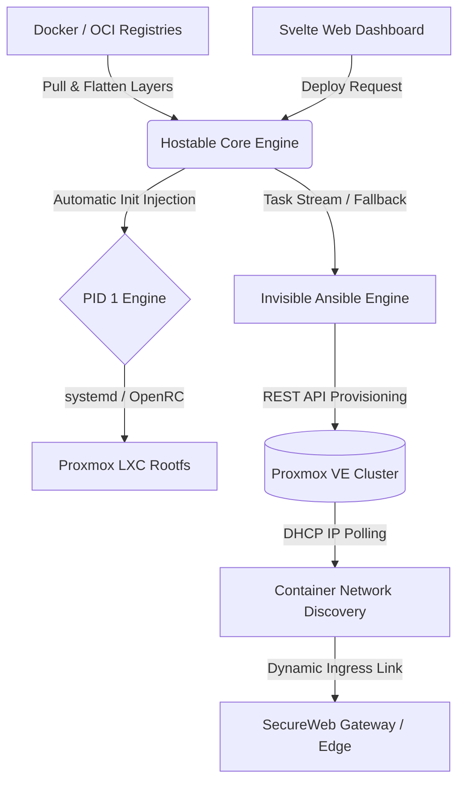

# Hostable 🚀

**Hostable** is a modern, high-performance container deployment platform for **Proxmox Virtual Environment (PVE)**. It bridges the gap between Docker/OCI container registries and native Proxmox LXC virtualization by intelligently converting Docker container images directly into native LXC containers with **zero Docker daemon overhead**.

---

## 🌟 Highlights & Architecture



- ⚡ **Daemonless Pure-Rust OCI Layer Extractor**: Pulls layers directly from Docker Hub, GHCR, or Quay via HTTP APIv2, unpacks tar/gzip streams in-memory, resolves whiteouts (`.wh.*`), and compresses directly into Proxmox `tar.xz` rootfs templates.
- 🛡️ **Embedded PID 1 Init Engine**: Automatically inspects image `ENTRYPOINT`, `CMD`, `ENV`, and `WORKINGDIR` to generate `/etc/systemd/system/hostable-app.service` and OpenRC runscripts, ensuring arbitrary Docker containers launch their services seamlessly in LXC.
- 💾 **Dual-Database Support (Zero External Dependencies)**: Operates out-of-the-box using embedded **SQLite** (`hostable.db`) requiring 0 external database containers. Automatically connects to **PostgreSQL** if `DATABASE_URL` is set.
- 🌐 **Dynamic Infrastructure & IP Polling**: Auto-discovers unused VMIDs, storage pools (`zfs`, `lvmthin`), and network bridges (`vmbr0`). After container boot, asynchronously polls `lxc/{vmid}/interfaces` on the designated interface (`eth0`) to obtain the true assigned IP.
- 🎭 **Invisible Ansible Automation Engine**: Modular Ansible playbooks and roles execute transparently in the background, streaming task progress (`TASK [...]`, `ok`, `changed`) live to the web terminal via WebSockets, with automatic fallback to native Proxmox REST API.
- 🔐 **SecureWeb Gateway Integration**: Auto-registers provisioned containers as upstream services with TLS termination, rate-limiting, and zero-trust proxying.
- 📦 **Single-Binary Delivery**: The entire Svelte SPA dashboard is bundled inside the Rust binary using `rust-embed`.

---

## 🚀 Quick Start & Installation

### Option 1: One-Line Proxmox Host Installer (Recommended)
Log in to your Proxmox server shell as `root` and run:

```bash
wget -qO- https://raw.githubusercontent.com/tim2zg/hostable/main/install.sh | bash
```

The installer will automatically:
1. Generate an isolated Proxmox API token (`root@pam!hostable`).
2. Download the latest Alpine Linux OS template.
3. Spin up an unprivileged LXC container with Ansible and OpenRC.
4. Deploy the Hostable binary and set up the background system service.
5. Provide your web dashboard URL (`http://<lxc_ip>:3000`) and Admin API token.

---

### Option 2: Install Inside an Existing LXC Container
If you already have a container running Debian, Ubuntu, or Alpine:

```bash
wget -qO- https://raw.githubusercontent.com/tim2zg/hostable/main/install_in_lxc.sh | bash
```

---

## ⚙️ Configuration Reference

Hostable is configured via environment variables or `/etc/hostable/.env`:

| Variable | Default | Description |
| :--- | :--- | :--- |
| `PROXMOX_HOST` | `127.0.0.1` | Proxmox VE node IP or FQDN |
| `PROXMOX_TOKEN_ID` | — | API Token ID (e.g. `root@pam!hostable`) |
| `PROXMOX_TOKEN_SECRET` | — | API Token UUID secret |
| `PORT` | `3000` | Web Dashboard and API server port |
| `DATABASE_URL` | `sqlite:///etc/hostable/hostable.db` | Database connection (SQLite or PostgreSQL) |
| `HOSTABLE_DEFAULT_NETWORK`| `eth0` | Target network interface for container IP polling |
| `HOSTABLE_DEFAULT_BRIDGE` | `vmbr0` | Default Proxmox virtual network bridge |
| `SECUREWEB_GATEWAY_URL` | — | Optional upstream URL for SecureWeb Gateway |

---

## 🛠️ Development & Building

### Prerequisites
- Rust 1.80+ (`cargo`)
- Node.js 20+ (`npm`)

### 1. Build the Frontend
```bash
cd frontend
npm install
npm run build
cd ..
```

### 2. Run Backend with Embedded UI
```bash
cd backend
cargo run -- start
```
The server will start on `http://localhost:3000` and generate your Admin API token on first boot.

### 3. Running Unit Tests
```bash
cargo test --manifest-path backend/Cargo.toml
```

---

## 📄 License
MIT License.
