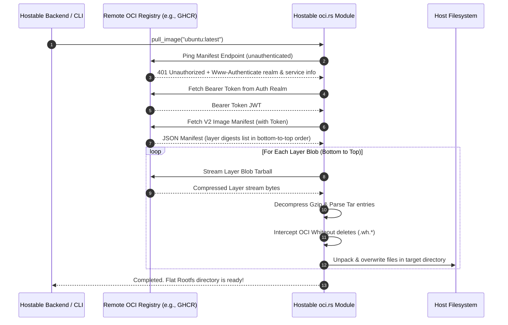

# 🐳 Zero-Daemon OCI/Docker to LXC Extractor Architecture

Hostable features a high-performance, native **Zero-Daemon OCI/Docker to LXC Extractor** built directly in Rust. This feature allows Hostable to pull any public container image from any OCI Registry (e.g., Docker Hub, GitHub Container Registry, Quay, etc.), download and stream its layer tarballs, resolve sequential file overlays and deletions, and produce a flattened, Proxmox-compatible LXC root filesystem—**all in user-space without requiring the Docker daemon or root privileges.**

---

## 🎯 Why This is Superior

| Feature | Distrobuilder Method | Docker Export Method | **Hostable Native Rust Extractor** |
| :--- | :--- | :--- | :--- |
| **Daemon Required?** | ❌ No | ⚠️ Yes (`dockerd` must run) | **✅ No (Pure Rust)** |
| **Root/Sudo Needed?** | ⚠️ Yes (loop mounts) | ⚠️ Yes (group/root membership) | **✅ No (Runs in user-space)** |
| **Resource Overhead** | ⚠️ High (virtualization/compiling) | ⚠️ Medium (daemon storage layers) | **✅ Extremely Low (Streaming memory)** |
| **Multi-Registry** | ❌ Complex setups | ✅ Native Docker configurations | **✅ Native Dynamic Discovery** |
| **Execution Speed** | ❌ Slow | ⚠️ Medium | **✅ Ultra-Fast (Buffered IO)** |

---

## ⚙️ How It Works under the Hood



---

## 🛠️ CLI Usage Reference

You can run the extractor directly from your terminal using the compiled Hostable CLI binary:

```bash
# Pull and flatten Alpine Linux
./target/release/cli pull-docker --image alpine:latest --out ./templates/alpine-rootfs

# Pull and flatten Jellyfin from GitHub Container Registry (GHCR)
./target/release/cli pull-docker --image ghcr.io/linuxserver/jellyfin:latest --out ./templates/jellyfin-rootfs
```

---

## 🌐 REST API Reference

The Hostable main HTTP server exposes a secure API endpoint to trigger image extractions programmatically.

### Endpoint
`POST /api/convert/docker-image`

### Headers
*   `Authorization: Bearer <your_api_token>`
*   `Content-Type: application/json`

### Request Body
```json
{
  "image": "lscr.io/linuxserver/jellyfin:latest",
  "name": "jellyfin"
}
```

### Response (Immediate 200 OK)
Because downloading and flattening image layers takes some time, the endpoint initiates the task in a high-performance **background thread (Tokio task)** and returns immediately to prevent HTTP timeouts.

```json
{
  "status": "success",
  "message": "Triggered extraction of lscr.io/linuxserver/jellyfin:latest in the background. It will be saved as template 'jellyfin'."
}
```

---

## ⚠️ OCI Whiteout Specifications Handled

OCI layers are strictly additive. File deletions and overwrites are recorded using special metadata placeholders inside the tarballs:
1.  **Opaque Directory Whiteout (`.wh..wh..opq`):**
    *   *Meaning:* Wipes out all pre-existing files in the directory containing this file (from earlier layers).
    *   *Resolution:* Our Rust extractor instantly executes a directory purge on the target folder before unpacking the current layer.
2.  **Standard OCI File/Directory Whiteout (`.wh.<filename>`):**
    *   *Meaning:* Indicates that `<filename>` was deleted.
    *   *Resolution:* Our Rust extractor deletes the target file immediately on disk and skips unpacking the placeholder itself.
