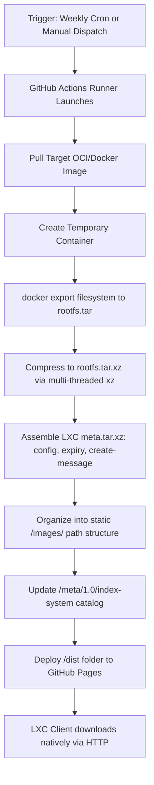

# 🚀 Hostable LXC: Automated Docker to LXC Image Pipeline & Server

Welcome to **Hostable LXC**! This repository template contains a fully automated pipeline designed to convert popular Docker/OCI containers (such as the optimized system containers from [Linuxserver.io](https://www.linuxserver.io/)) into ready-to-run, native LXC system containers, and hosts them as a fully-compliant **LXC Download Server** directly on GitHub Pages!

Additionally, this pipeline packages and registers the containers into the **GitHub Container Registry (GHCR)**.

---

## 💎 Features

*   **Zero-Infrastructure Build:** Runs entirely on standard, free GitHub-hosted Actions runners (no self-hosted, privileged, or paid VMs required).
*   **Bulletproof Flattening:** Uses `docker export` to perfectly extract the complete container root filesystem (`rootfs.tar.xz`), preserving all custom optimizations and software setups.
*   **Compliant Download Server:** Automatically builds standard LXC catalog indices (`index-system` / `index-user`), allowing LXC nodes to directly interact with this repository as a native image download repository!
*   **Automatic Weekly Updates:** Runs on a weekly cron schedule to fetch the latest application releases from Linuxserver.io, rebuild, and update your catalog.
*   **Manual Custom Builds:** Trigger a pipeline run manually via the GitHub interface for *any* public Docker image.

---

## 🛠️ How It Works under the Hood



---

## 🚀 Setup Instructions

Follow these quick steps to get your automated LXC pipeline and image server up and running in minutes:

### 1. Create Your GitHub Repository
1. Create a new repository on GitHub (e.g., named `hostable-lxc`).
2. Clone it locally, copy the files from this directory (`build_lxc.sh`, `.github/workflows/build-lxc-images.yml`, and this README) into it.
3. Commit and push the files to your main branch:
   ```bash
   git add .
   git commit -m "feat: initialize automated LXC pipeline and image server"
   git push origin main
   ```

### 2. Configure Repository Permissions & GitHub Pages
To allow the GitHub Actions runner to write release catalog indices and deploy your website, enable the following settings on your GitHub repository:

1. **Pages Activation:**
   * Go to **Settings** -> **Pages**.
   * Under **Build and deployment** -> **Source**, select **GitHub Actions**.
2. **Workflow Permissions:**
   * Go to **Settings** -> **Actions** -> **General**.
   * Scroll down to **Workflow permissions**.
   * Select **Read and write permissions** (required to write pages builds and push container packages to GHCR).
   * Click **Save**.

---

## ⚡ Running Your First Build

You can trigger builds in two ways:

### A. Manual Build (Any Docker Image!)
You can package *any* public Docker image into an LXC container on-demand:
1. Go to the **Actions** tab of your repository.
2. Under **Workflows** in the sidebar, select **Build and Deploy LXC Images**.
3. Click the **Run workflow** dropdown on the right.
4. Input your custom parameters:
   * **Docker image:** e.g., `lscr.io/linuxserver/jellyfin:latest`
   * **LXC distribution name:** e.g., `jellyfin`
   * **LXC release name:** e.g., `latest`
   * **Push container image to GHCR:** `true`
5. Click **Run workflow**.

### B. Scheduled Weekly Builds
By default, the pipeline runs every **Sunday at midnight** to automatically keep the following standard templates fresh and up-to-date:
*   **Jellyfin** (`lscr.io/linuxserver/jellyfin:latest`)
*   **Radarr** (`lscr.io/linuxserver/radarr:latest`)
*   **Nginx Proxy Manager** (`jc21/nginx-proxy-manager:latest`)

---

## 📥 Using Your LXC Download Server

Once your first GitHub Action completes, your image server is live at `https://<your-username>.github.io/<your-repo-name>/`! Here is how to use it:

### Method 1: Create a Container Natively via the LXC CLI
From your Proxmox node, home server, or Linux system, you can use the standard `lxc-create` tool. Simply pass your custom GitHub Pages URL as the server parameter:

```bash
lxc-create -n my-jellyfin-container \
  -t download -- \
  --server <your-username>.github.io/<your-repo-name> \
  --dist jellyfin \
  --release latest \
  --arch amd64
```

> [!TIP]
> The CLI will fetch your `/meta/1.0/index-system` catalog file, verify the image exists, and automatically download and install `meta.tar.xz` and `rootfs.tar.xz` directly from your GitHub Pages server!

### Method 2: Manually Importing into Proxmox VE
If you are running **Proxmox VE**, you can import the custom templates directly into your local storage:

1. Locate the download URL for the `rootfs.tar.xz` file from your pipeline build run or by viewing your Pages index.
2. Access your Proxmox terminal or local storage dashboard.
3. Download the rootfs directly into your Proxmox template cache directory:
   ```bash
   cd /var/lib/vz/template/cache/
   wget -O hostable-jellyfin-latest.tar.xz https://<your-username>.github.io/<your-repo-name>/images/jellyfin/latest/amd64/default/<build_date>/rootfs.tar.xz
   ```
4. Now, go to the Proxmox Web GUI, select **Create CT**, choose your local storage, and you will see your new `hostable-jellyfin-latest.tar.xz` container template ready to be deployed!

---

## 🐳 Running from GHCR (LXD / Incus)
If you are using **LXD** or **Incus**, you can launch the container directly using the OCI images published by the pipeline to your GitHub Container Registry:

```bash
lxc launch docker:ghcr.io/<your-username>/<your-repo-name>/jellyfin:latest my-jellyfin
```

---

## 🔒 Security and Optimization Settings
Because these containers are exported from Docker images, they don't contain standard system systemd or sysvinit initializations by default unless built on a full distro base.

When launching your container, ensure the following LXC options are applied to allow standard operation:
*   **Nesting Enabled:** Set `features: nesting=1` in Proxmox to allow services to manage their internal mount points and system environments properly.
*   **Unprivileged Safety:** Standard LXC containers run as unprivileged, which is highly recommended for security. Ensure your filesystems and UID/GID mapping (such as PUID/PGID inside Linuxserver.io apps) match your host setup.
